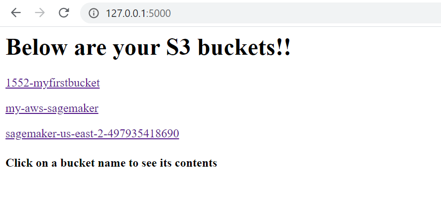
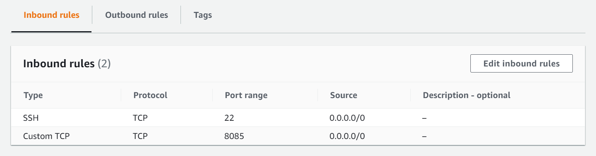
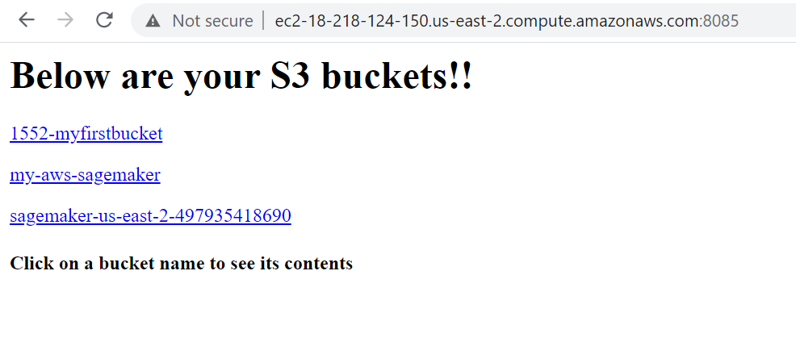
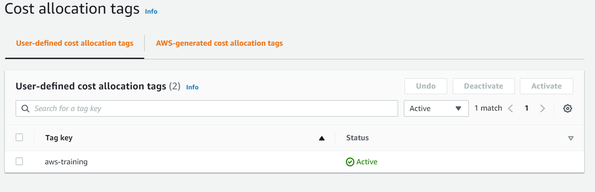
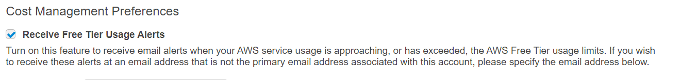
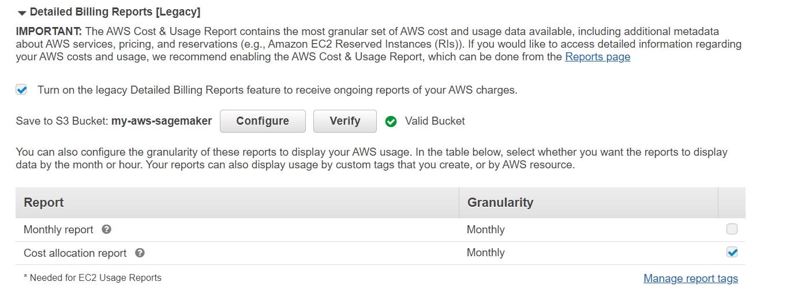

# flask-list-folders

This code is used to list the folder structure and contents of S3 buckets using boto3

## Create the environment from .yml file

   - conda env create -f env.yml
   The environment consists of all the required dependencies installed

## Activate the environment created

   - conda activate flask-env
   
## Make sure to add your credentials in the file ~/.aws/credentials

   [default]
   
   aws_access_key_id = 'your_access_key'
   
   aws_secret_access_key = 'your_secret_key'

## How to run the script

   python flask-app.py 
   
## Output of the script

  Below is the output of local execution of the python script
   
  

  
  

## EC2 Instance Security Group 

  In order to access the flask-app via the EC2-public URL Security groups have to be configured 

  - Inbound Rules 
  

  
  

## Accessing the EC2-deployed flask-app via the EC2-public URL at the port 8085
  
  

  
  

## Cost Allocation Tags
  
  Tags are attached to resources during creation for effective AWS resource management.
  To view tags in the Billing reports they have to be activated first for cost allocation:
  
  

  
  

## Billing Report

   The Billing Report can be viewed filtering on specific tags. 
   Here **aws-training** is the tag created and **assignment-1** is the value
   
   

  
  

## Billing Configuration

   - Billing can be configured to recieve alerts on free-tier usage
   
   

  
  

   - Also the reports can be configured to be stored in S3 bucket
   
   

  
  

   
   
 

   
